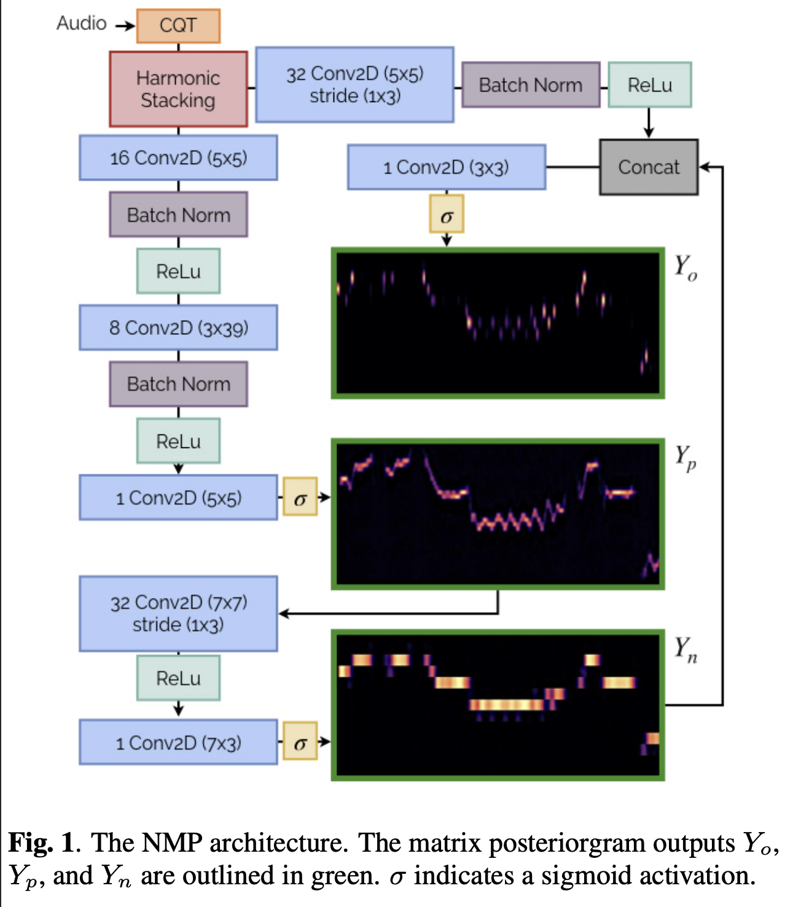

> ICASSP [Paper](https://arxiv.org/pdf/2203.09893.pdf) [Github](https://github.com/spotify/basic-pitch)  
> Rachel M. Bittner, Juan José Bosch, David Rubinstein, Gabriel Meseguer-Brocal, Sebastian Ewert  
> Spotify, IRCAM  
> 12 May 2022  

## Abstract
**기존의 문제점**
- Automatic Music Transcription(자동 악보 생성) 분야는 복잡성이 높음
- 일반적으로 특정 상황에 초점을 맞춤 시스템에서 가장 좋은 결과가 나옴
  - 특정 악기에 특화된 시스템이 성능이 더 good
- 노트 이벤트 검출(음의 시작과 끝을 정확히 측정해 정확한 음표를 찾기) task가 프레임 단위 음의 높이를 판단(f0 주파수 예측)하는 것보다 어려움
- 모델이 복잡 -> 실시간 환경에 부적합

**논문에서의 제안**
- 보컬 뿐만 아니라 다양한 악기에 일반환 가능
- 다성(polyphonic) 음도 판단 가능
- 악기 비특화 + 저자원 환경

## Introduction
- AMT 분야의 서브테스크
  - 출력의 다성도 : 단일음 vs 다성음
  - 예측 대상 종류 : 노트 vs 기본 주파수 f0
  - 입력 오디오의 종류
- 문제점은 위의 Abstract에서 언급함
- 예시 논문
  - [피아노](https://archives.ismir.net/ismir2021/paper/000030.pdf) [기타](https://transactions.ismir.net/articles/10.5334/tismir.23) [보컬](https://archives.ismir.net/ismir2021/paper/000036.pdf)
- 논문에서의 제안
  - 메모리와 연산 요구 낮음 -> 저사양 장치에서도 효율
  - 악기 종류 신경 X
  - 프레임 단위 온셋, 다중피치, 노트 posteriorgram을 동시 예측
  - 추론 시, posteriorgram 출력을 후처리하여 노트 이벤트 및 다중 피치 정보 획득 (posteriorgram은 확률 정보이므로 악보 형태로 바로 만들기는 어려움)

## Background and related work
- 프레임 단위 다중 피치 추정(MultiPitch Estimation)
  - posteriorgram을 통해 기본 주파수(f0)를 예측 
  - 비브라토, 글리산도와 같은 저수준 표현 정보 제공
  - MPE 결과를 가지고 노트 이벤트로 그룹화하거나 음의 윤곽으로 묶기
- 노트 추정 : 악보에 가까운 정보 제공
  - 노트 추정은 노트 이벤트를 직접 추정하는 것을 목표로 함
- MPE 출력만으로 노트를 쉽게 얻진 못함 -> 다음 방법 이용
  - 중앙값 필터링
  - 히든 마르코프 모델
  - 신경망 기반 추론
- 최근 트랜스포머 화로용 -> 스펙트로그램에서 직접 midi 형태 노트 이벤트 예측하려는 연구도 있음 (높은 비용)

> 🎤 A가 노래 부름 → 피치가 C4 근처에서 살짝 흔들림
> ✅ MPE는: "0.49초에 C4가 92% 확률로 울림"이라고 추정
> ✅ Note Estimation은: "0.45초~1.0초에 C4 음이 있음"으로 하나의 노트로 표현하려고 함

## Model
<!--  -->

  

**입력 전처리 - 하모닉 스태킹**
1. 입력 오디오 
2. CQT 변환(음높이에 따라 로그 스케일로 주파수를 나누어 시간-주파수 표현 만듦)
3. 처음부터 음 높이 축(반음)으로 맞춰진 표현으로 사용해 효율성 good
4. HCQT는 배음을 한 곳에 모아 합성곱 필터가 배음 패턴을 잡기 쉽게 만듦
5. 여기서는 HCQT를 정확히 계산하지 않고, CQT를 복사해 배음에 해당하는 주파수 방향으로 시프트하여 근사함

**모델 아키텍처**
- FCN 구조, 16782 파라미터
- 모델 출력 : 3가지 posteriorgram 후방확률 맵 만듦(시간-주파수 형태)
  - Yo : 노트 온셋(음의 시작하는 시점) 여부
  - Yn : 노트가 활성화된 상태
  - Yp : 음높이 활성 상태 (다중 음정 정보, 비브라토 등 미세 표현 포함)
- 출력 해상도
  - Yo, Yn : 1반음당 1빈(bin) 해상도
  - Yp : 1반음당 3빈 해상도

**아키텍처 구성**
- Yp 먼저 추정
- Yp 바탕으로 Yn 추정하는 작은 합성곱 총 2개 추가
- Yo는 Yn과 입력 오디오의 합성곱 특징을 결합해 추정

**학습**
- 손실 함수 : 각 출력별 BCE
- Yo는 매우 불균형한 클래스
  - 부정 클래스에 0.05 가중치, 긍정 클래스에 0.95 가중치 > 희소한 온셋을 잘 잡게 함
- 입력 오디오 길이는 2초, 샘플레이트 : 22050 Hz
- 데이터 증강 : 라벨에 영향 없는 노이즈, EQ 필터, 리버브 효과 추가하기

**후처리 > 노트 이벤트**
- Yo에서 온셋 후보 추출(0.5 미만 확률 피크는 버림)
- 온셋 후보를 시작점으로 해서 Yn에서 앞으로 추적하며 음이 꺼지는 시점까지 음 길이 추정
- 음 길이가 너무 짧으면 제거
- 나중에 온셋이 없는 프레임에서도 Yn의 높은 확률을 통해 음 이벤트 찾기
- Yp에서는 단순 피크를 골라 다중음 추정 수행